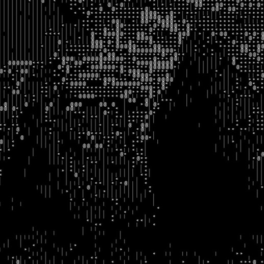

## A Sudo GAN model that generates ASCII art

# Project Description
This is the first demo of my SGAN(SUDO Generative Adeversial Network).
It uses a discriminator that is implementaion of the original paper. The unique part of this project is the generator part. GAN models generate data from random noise.
My model however, generates characters from image and then creates image representation of these characters and feed it as a fake input for discriminator.

# How To Run
Open the test_results notebook and specify the path, then run it. Enjoy your ASCII Art!

# Some test results

<table>
  <tr>
    <td>
      
    </td>
    <td>
      
    </td>
  </tr>
  <tr>
      <td>
      
    </td>
    <td>
      
    </td>
  </tr>
</table>

# Final Notes and Future Goals
This is just a demo and generator needs alot of improvment. My final goal is to generate small size strings that can be used as emojies and stickers while chatting with your friend.
